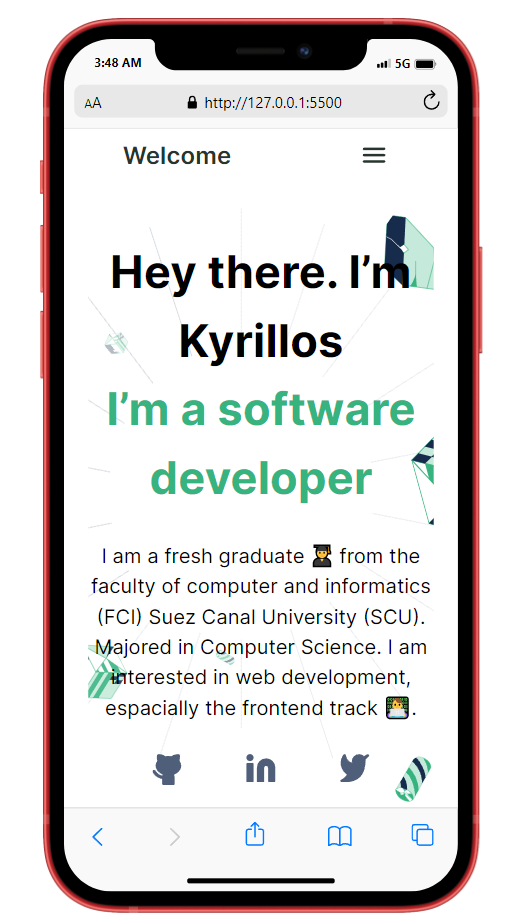

# Portfolio

> ### This is a website that exemplifies my skills, projects, qualifications, education, training, experiences, and resume.

## Built With

- HTML - HTML5
- CSS - CSS3

## Additional tools

- Figma
- FormSpree

## Live Demo

[Live Demo Link](https://bondok6.github.io/Portfolio/)

## Getting Started

To get a local copy up and running follow these simple example steps.

`git clone git@github.com:Bondok6/Portfolio.git`

## Authors

👤 **Author1**

- GitHub: [@Bondok6](https://github.com/Bondok6)
- LinkedIn: [LinkedIn](https://linkedin.com/in/linkedinhandle)

## 🤝 Contributing

Contributions, issues, and feature requests are welcome!

Feel free to check the [issues page](../../issues/).

### List of Contribuitors

- GitHub: [@marcelosdata](https://github.com/marcelosdata)
- LinkedIn: [LinkedIn](https://www.linkedin.com/in/msn9/)

## Show your support

Give a ⭐️ if you like this project!

## 📝 License

This project is [MIT](./MIT.md) licensed.
