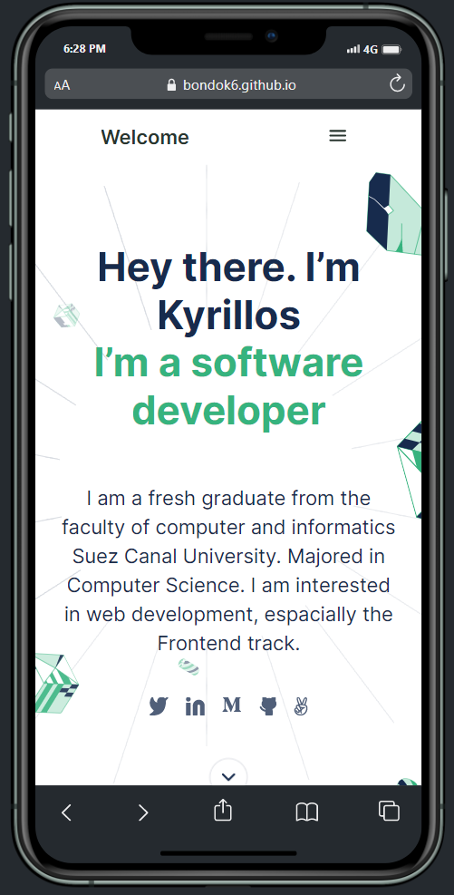

# Portfolio

> ### This is a website that exemplifies my skills, projects, qualifications, education, training, experiences, and resume.

## Built With

- HTML - HTML5
- CSS - CSS3

## Additional tools

- Figma
- Google Analytics
- FormSpree

## Live Demo

[Kyrillos's Portfolio](https://bondok6.github.io/Portfolio/)

## Getting Started

To get a local copy up and running follow these simple example steps.

1. Run `git clone git@github.com:Bondok6/Portfolio.git`

2. Run `cd Portfolio`

3. Open `index.html` in browser.

## Authors

👤 **Kyrillos Hany**

- GitHub: [@Bondok6](https://github.com/Bondok6)
- LinkedIn: [LinkedIn](https://www.linkedin.com/in/kyrillos-hany/)

## 🤝 Contributing

Contributions, issues, and feature requests are welcome!

Feel free to check the [issues page](../../issues/).

### List of Contribuitors

👤 **Marcelo**

- GitHub: [@marcelosdata](https://github.com/marcelosdata)
- LinkedIn: [LinkedIn](https://www.linkedin.com/in/msn9/)

👤 **Fernando**

- GitHub: [@fernando](https://github.com/fherrerao)
- LinkedIn: [LinkedIn](https://www.linkedin.com/in/fernando-herrera-25a6361b2/)

👤 **Nicolas**

- GitHub: [@Nicolas](https://github.com/Nicolaswg)
- LinkedIn: [LinkedIn](https://www.linkedin.com/in/nicolas-gonzalez-8623461a0/)

👤 **Jordan**

- GitHub: [@Jordan](https://github.com/Jord4N-AC)

## Show your support

Give a ⭐️ if you like this project!

## 📝 License

This project is [MIT](./MIT.md) licensed.
